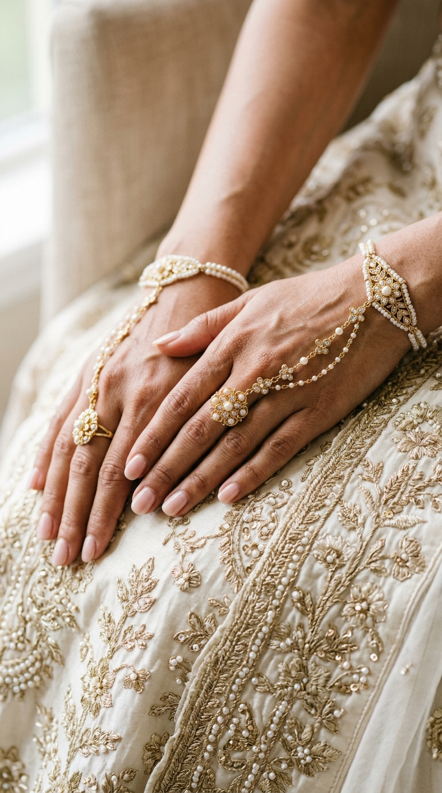
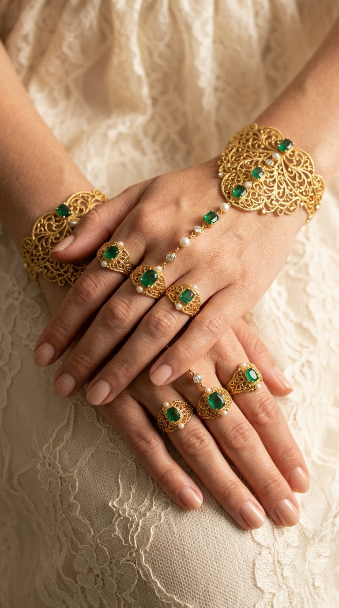
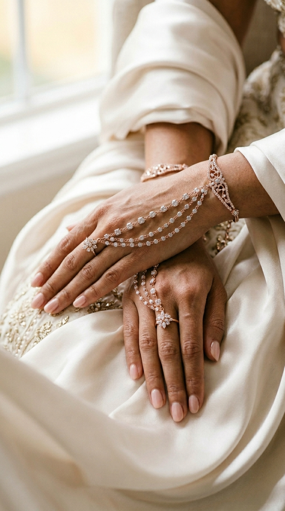

<!DOCTYPE html>
<html>
<head>
  <title>My Art Portfolio</title>

  

</head>

<body>

  <h1>My Art Portfolio</h1>

  

    <h2>My Artwork</h2>

    

      
      
      
    

  

</body>
</html>
